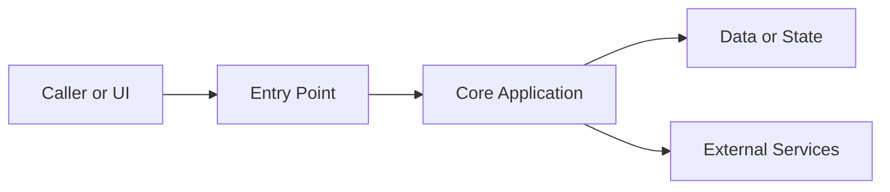
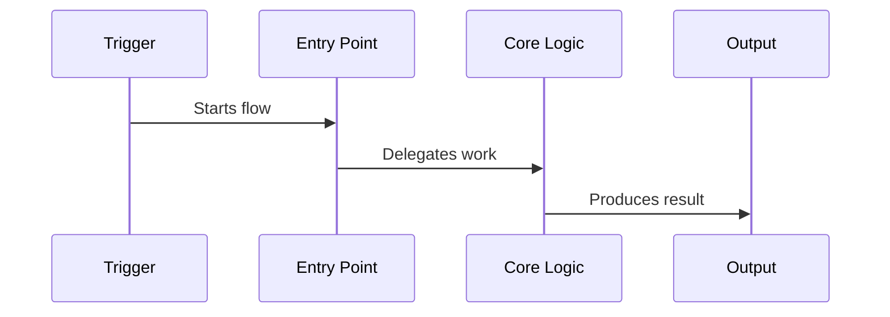
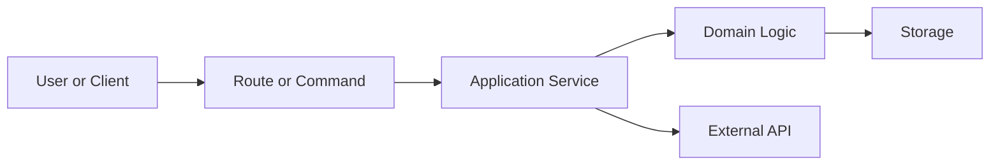
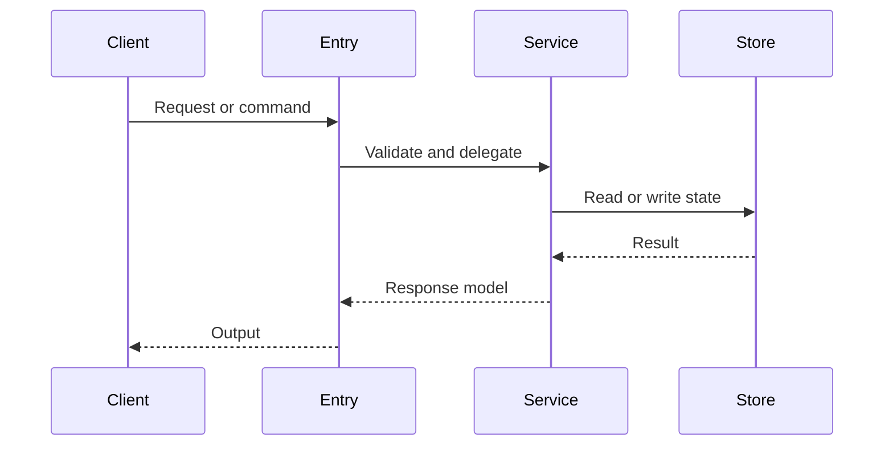

# Project Code Onboarding

<!-- Maintenance: the description above and agents/openai.yaml (display_name / short_description / default_prompt) describe the same skill. Keep them in sync when either changes. -->

## Overview

Create one Markdown document that lets a new engineer quickly understand what the project is, how it is structured, where the main entry points live, which interfaces it exposes or consumes, and how the most important runtime flows work. Include a small number of Mermaid diagrams where they materially improve understanding.

Default output path: `docs/project-onboarding.md`. If the repo has an existing docs convention, follow it instead.

If an onboarding document already exists, run in **incremental mode**: diff the current code against what the doc claims, update only the sections that drifted (use `git log` since the doc's last change to find what moved), and preserve still-accurate content rather than regenerating from scratch.

## Workflow

**Step 0 — Scope and budget (do this first).**

- Estimate repo size before mapping: `rg --files | wc -l` plus a quick look at top-level folders. Use this to pick a strategy, not to load everything.
- Small (≲ 50 source files): full pass is fine.
- Medium: prioritize the active application path; skip examples, fixtures, generated code, and tests in the first pass.
- Large / monorepo (many packages or thousands of files): do **not** attempt full coverage. Identify the candidate subsystems/packages, then ask the user which one(s) to focus on, or default to the most actively changed area (see git-freshness below) and say so explicitly.
- Multi-language / multi-service repos: detect the distinct services/stacks first (e.g. `web` TS frontend + `api` Go backend + `infra` Terraform). Organize the document **by service**, each with its own short Code Map / Entry Points / Interfaces, rather than blending everything into one architecture.
- Use `git log` to gauge freshness: an `rg`/`ls` view shows what exists, but `git log --since=...` or `git log -n 20 --name-only` shows what is **alive**. Favor actively changed modules; flag obviously stale/abandoned folders as such instead of documenting them as core.

1. Identify the project type and documentation conventions.
   - Inspect root manifests and config first: `README*`, `package.json`, `pnpm-workspace.yaml`, `Cargo.toml`, `pyproject.toml`, `go.mod`, `pom.xml`, `build.gradle`, `pubspec.yaml`, `Package.swift`, `*.xcodeproj`, `docker-compose*`, `Dockerfile`, `Makefile`, `.github/workflows`, `docs/`.
   - Use `rg --files` and targeted reads; avoid bulk-loading generated, vendored, dependency, build, and lock files unless needed.
   - Treat README/docs as hints, not truth. When prose disagrees with what the code actually does, **the code wins** — document the real behavior and call out the mismatch (this is often the most valuable part of an onboarding doc, because stale docs are what trip up new engineers).

2. Map the codebase.
   - Find entry points: executable mains, app bootstrap files, server startup, route registration, CLI command registration, job workers, app delegate/main activity, package exports.
   - Find module boundaries: top-level source folders, packages, services, feature modules, shared libraries, generated code, tests.
   - Find external dependencies that shape architecture: web frameworks, routers, ORMs, queues, databases, auth libraries, SDKs, UI frameworks, state managers, build systems.

3. Extract interfaces.
   - Public APIs: HTTP routes/controllers, RPC handlers, GraphQL schema/resolvers, WebSocket events, CLI commands, exported libraries, plugin hooks, app deep links.
   - Consumed APIs: database tables/models, third-party service clients, queues/topics, filesystem paths, environment variables, config files.
   - For each important interface, capture method/name, path/command/event, main request inputs, response/output, auth/side effects, and source file.

4. Trace the main runtime flows.
   - Choose 3-6 flows that best explain the system, such as app startup, request handling, login/auth, primary user action, background sync/job, persistence, error handling, deployment/build.
   - Trace each flow from trigger to output through concrete files/functions/classes.
   - Mark inferred behavior explicitly when code is indirect or conventions are doing work.

5. Add necessary Mermaid diagrams.
   - Include one architecture diagram by default.
   - Include 1-3 runtime flow diagrams when the flows are important or non-obvious.
   - Prefer no more than 4 diagrams total for a 10-minute onboarding document.
   - Place each diagram near the section it explains, not in a detached appendix.

6. Write the document.
   - Prefer a clear, dense engineering brief over exhaustive reference docs.
   - Target ~10 minutes of reading, but scale to the repo: a small tool may need only 600-1000 words; a large multi-service repo may need more but should stay focused — never pad a small project or over-compress a big one to hit a fixed number. Coverage priority matters more than an absolute word count.
   - Use tables for maps and API summaries; use Mermaid plus numbered steps for runtime flows.
   - Cite a clickable `path/to/file.ext:line` anchor for every important claim (entry points, routes, models, flow steps), not just a folder or file name, so engineers can jump straight to the code and reviewers can verify nothing was invented.

7. Verify before finalizing.
   - Confirm the file was actually written to the intended path and re-open it to check that all sections are filled and links use repo-relative paths.
   - Confirm referenced files and line anchors exist (spot-check a few `file:line` citations against the real code).
   - Validate Mermaid for real, do not just eyeball it. Render each diagram with the mermaid CLI and fix any parse error before delivery, e.g.:
     ```bash
     # extract each ```mermaid block to a .mmd file, then:
     npx -y @mermaid-js/mermaid-cli -i diagram.mmd -o /tmp/diagram.svg
     ```
     If the CLI is unavailable, state in the final response that diagrams were not machine-validated.
   - Ensure the document names real entry points, real modules, real interfaces, and real flows from the repo.
   - Remove speculation or label it as inference.

## Document Structure

Use this structure unless the repo strongly suggests a better one:

````markdown
# Project Onboarding: <Project Name>

## 1. What This Project Does
One short paragraph on product/domain purpose, runtime shape, and primary users/callers.

## 2. 10-Minute Mental Model
- <3-7 bullets that explain the core architecture in plain engineering language>

## 3. Code Map
| Area | Path | Responsibility | Notes |
| --- | --- | --- | --- |

## 4. Architecture
Describe the major components and their dependencies. Include the default Mermaid architecture diagram.



## 5. Entry Points and Lifecycle
| Entry point | Source | What happens first | Downstream path |
| --- | --- | --- | --- |

## 6. Interfaces
### Exposed Interfaces
| Interface | Source | Inputs | Outputs / Side Effects |
| --- | --- | --- | --- |

### Consumed Interfaces
| Dependency | Source | Purpose | Contract / Config |
| --- | --- | --- | --- |

## 7. Main Runtime Flows
### Flow: <Name>


1. <Trigger and source file>
2. <Major processing step>
3. <Persistence/network/UI/output step>

## 8. Data and State
Summarize persistent data, in-memory state, schemas/models, caches, migrations, and ownership.

## 9. Build, Run, and Test
| Task | Command | Notes |
| --- | --- | --- |

## 10. Where To Change Things
| Goal | Start Here | Watch Out For |
| --- | --- | --- |

## 11. Open Questions / Risks
Only include unclear or risky areas found during code reading.
````

## Mermaid Diagrams

Use Mermaid diagrams as onboarding accelerators, not decoration. Every diagram must answer one concrete engineering question.

Default diagram set:

- Architecture diagram: show callers, entry points, main modules/services, persistence, and external systems. Use `flowchart LR` for most systems; use `flowchart TB` when the architecture is layered.
- Primary runtime flow: show the most important user/request/job path. Use `sequenceDiagram` when multiple actors exchange calls; use `flowchart TD` when control flow and branching matter more.
- Data/state flow: add only when persistence, caches, queues, or sync are central to understanding the project. Use `flowchart LR`.
- Deployment/build flow: add only when build, packaging, or runtime infrastructure is non-trivial.

Mermaid syntax rules:

- Wrap diagrams in fenced `mermaid` code blocks.
- Use simple ASCII node IDs such as `api`, `service`, `db`, `worker`; put human labels inside quotes.
- Avoid raw `1. Step` labels inside nodes because some renderers parse them as Markdown lists. Use `Step 1:`, `(1)`, or unnumbered labels.
- Use `subgraph id["Display Name"]` when grouping components; refer to the ID, not the display label.
- Avoid quotes inside node labels. Use single words, colons, slashes, or hyphens instead.
- Keep node labels short. Put detailed explanations in nearby prose or tables.
- For Chinese / non-ASCII labels (common for these triggers): keep the node **ID** ASCII (`auth`, `db`) and put the Chinese text inside the quoted label, e.g. `auth["登录鉴权"]`. Avoid `()`, `[]`, `:`, `;`, and quotes *inside* a label, as they break parsing in several renderers; use a hyphen or wording instead.
- Do not invent components to make a diagram look complete. If a relationship is inferred, label the surrounding prose with `Inferred:`.

Common templates:





## Investigation Patterns

Use the repo's language and framework conventions:

- JavaScript/TypeScript: inspect `package.json` scripts/exports, framework config, `src/`, `app/`, `pages/`, route files, API handlers, state stores, service clients.
- Python: inspect `pyproject.toml`, package modules, `__main__.py`, ASGI/WSGI apps, routers, CLIs, ORM models, migrations.
- Go: inspect `go.mod`, `cmd/`, `main.go`, `internal/`, `pkg/`, route registration, interfaces.
- Rust: inspect `Cargo.toml`, `src/main.rs`, `src/lib.rs`, crates, features, route/command setup.
- Java/Kotlin: inspect Gradle/Maven config, Spring controllers/services/config, Android entry points.
- Swift/iOS/macOS: inspect `Package.swift` or Xcode project, `@main`, app delegates, views/view models, services.
- Flutter/Dart: inspect `pubspec.yaml`, `lib/main.dart`, routes, providers/blocs/controllers, platform integrations.

Search examples. Prefer several narrow, intent-named searches over one giant OR regex — on large repos a catch-all pattern returns too much noise to localize. Run them per concern:

```bash
rg --files
rg -n "func main|@main|if __name__|fn main"                       # entry points
rg -n "createServer|listen\\(|app\\.(get|post|put|delete)|router\\.|Route\\(|Controller"  # http/routing
rg -n "cobra|click|argparse|Command\\(|CLI"                        # CLI surfaces
rg -n "Queue|Worker|cron|schedule|consumer|@app.task"             # async/jobs
rg -n "migrate|schema|model|Entity|@Table|CREATE TABLE"           # persistence
rg -n "process\\.env|os\\.environ|getenv|Config|dotenv"           # config/env
```

## Writing Rules

- Write for a competent engineer joining the project, not for a product manager.
- Prefer concrete names over generic descriptions: name files, classes, functions, routes, commands, services, env vars, and models.
- Do not paste large code blocks. Summarize behavior and cite source paths.
- Use Mermaid for necessary architecture and flow diagrams; keep them compact and readable in GitHub/Obsidian-style Markdown renderers.
- Distinguish facts from inferences: use "Inferred:" when behavior follows framework convention or incomplete evidence.
- If a section has no evidence in the repo, write "Not found in this pass" rather than inventing content.
- If the repo is large, prioritize the active application path over examples, archived folders, generated files, and tests.

## Final Response

Tell the user where the Markdown file was written and summarize the biggest architectural findings in 2-4 bullets. Mention any sections that remain uncertain because the code did not expose enough evidence, whether Mermaid diagrams were machine-validated, and — for large repos — which subsystems were intentionally left out of scope.
