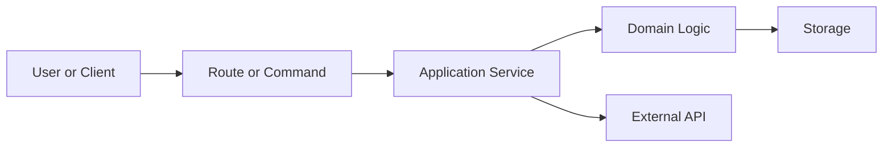
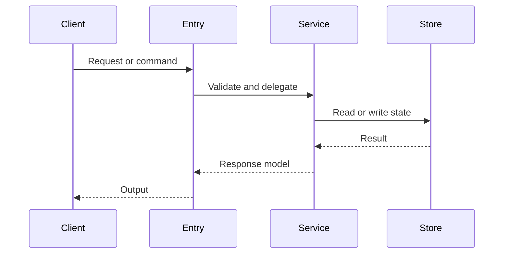

# Mermaid Reference

Use Mermaid diagrams as onboarding accelerators, not decoration. Every diagram must answer one concrete engineering question. Keep no more than 4 diagrams total for a 10-minute document.

## Default diagram set

- **Architecture diagram**: show callers, entry points, main modules/services, persistence, and external systems. Use `flowchart LR` for most systems; use `flowchart TB` when the architecture is layered.
- **Primary runtime flow**: show the most important user/request/job path. Use `sequenceDiagram` when multiple actors exchange calls; use `flowchart TD` when control flow and branching matter more.
- **Data/state flow**: add only when persistence, caches, queues, or sync are central to understanding the project. Use `flowchart LR`.
- **Deployment/build flow**: add only when build, packaging, or runtime infrastructure is non-trivial.

## Syntax rules

- Wrap diagrams in fenced `mermaid` code blocks.
- Use simple ASCII node IDs such as `api`, `service`, `db`, `worker`; put human labels inside quotes.
- Avoid raw `1. Step` labels inside nodes because some renderers parse them as Markdown lists. Use `Step 1:`, `(1)`, or unnumbered labels.
- Use `subgraph id["Display Name"]` when grouping components; refer to the ID, not the display label.
- Avoid quotes inside node labels. Use single words, colons, slashes, or hyphens instead.
- Keep node labels short. Put detailed explanations in nearby prose or tables.
- For Chinese / non-ASCII labels (common for these triggers): keep the node **ID** ASCII (`auth`, `db`) and put the Chinese text inside the quoted label, e.g. `auth["登录鉴权"]`. Avoid `()`, `[]`, `:`, `;`, and quotes *inside* a label, as they break parsing in several renderers; use a hyphen or wording instead.
- Do not invent components to make a diagram look complete. If a relationship is inferred, label the surrounding prose with `Inferred:`.

## Validation

Validate every diagram for real before delivery — do not just eyeball it:

```bash
# extract each ```mermaid block to a .mmd file, then:
npx -y @mermaid-js/mermaid-cli -i diagram.mmd -o /tmp/diagram.svg
```

Fix any parse error. If the CLI is unavailable, say so in the final response.

## Common templates




