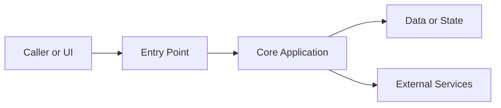
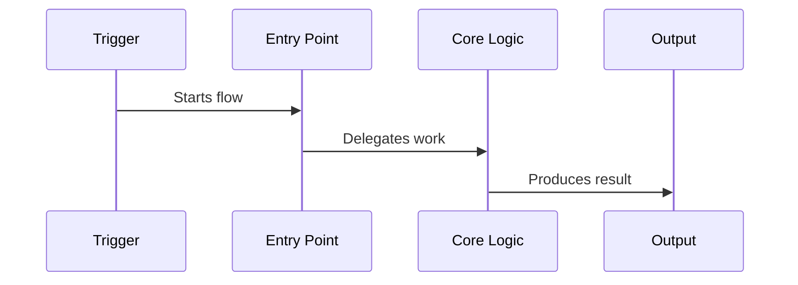

# Onboarding Document Template

Use this structure for the generated `docs/project-onboarding.md` unless the repo strongly suggests a better one. For multi-service repos, repeat sections 3-8 per service.

````markdown
# Project Onboarding: <Project Name>

## 1. What This Project Does
One short paragraph on product/domain purpose, runtime shape, and primary users/callers.

## 2. 10-Minute Mental Model
- <3-7 bullets that explain the core architecture in plain engineering language>

## 3. Code Map
| Area | Path | Responsibility | Notes |
| --- | --- | --- | --- |

## 4. Architecture
Describe the major components and their dependencies. Include the default Mermaid architecture diagram.



## 5. Entry Points and Lifecycle
| Entry point | Source | What happens first | Downstream path |
| --- | --- | --- | --- |

## 6. Interfaces
### Exposed Interfaces
| Interface | Source | Inputs | Outputs / Side Effects |
| --- | --- | --- | --- |

### Consumed Interfaces
| Dependency | Source | Purpose | Contract / Config |
| --- | --- | --- | --- |

## 7. Main Runtime Flows
### Flow: <Name>


1. <Trigger and source file>
2. <Major processing step>
3. <Persistence/network/UI/output step>

## 8. Data and State
Summarize persistent data, in-memory state, schemas/models, caches, migrations, and ownership.

## 9. Build, Run, and Test
| Task | Command | Notes |
| --- | --- | --- |

## 10. Where To Change Things
| Goal | Start Here | Watch Out For |
| --- | --- | --- |

## 11. Open Questions / Risks
Only include unclear or risky areas found during code reading.
````
